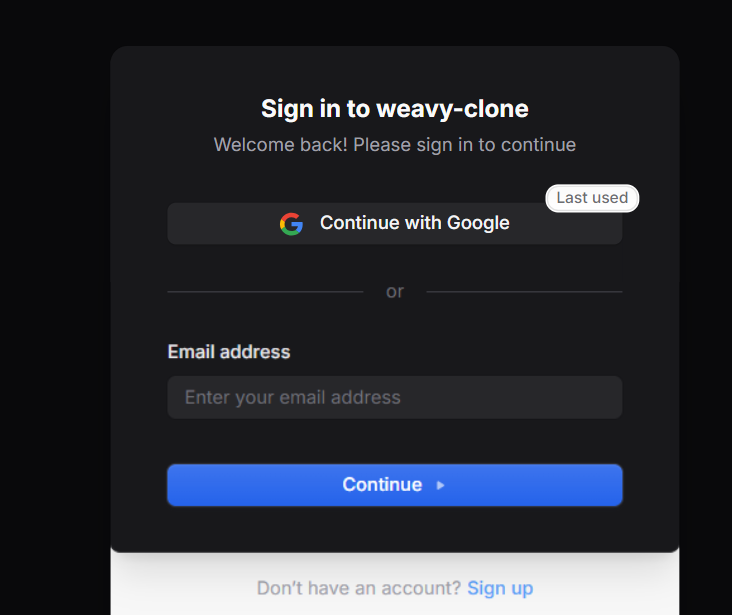
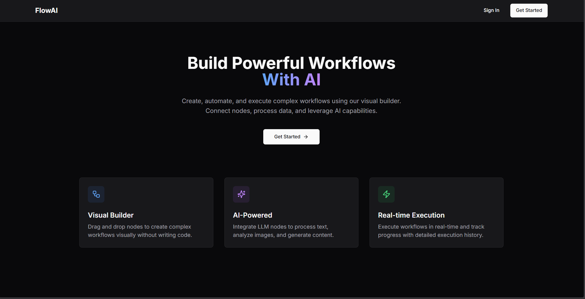
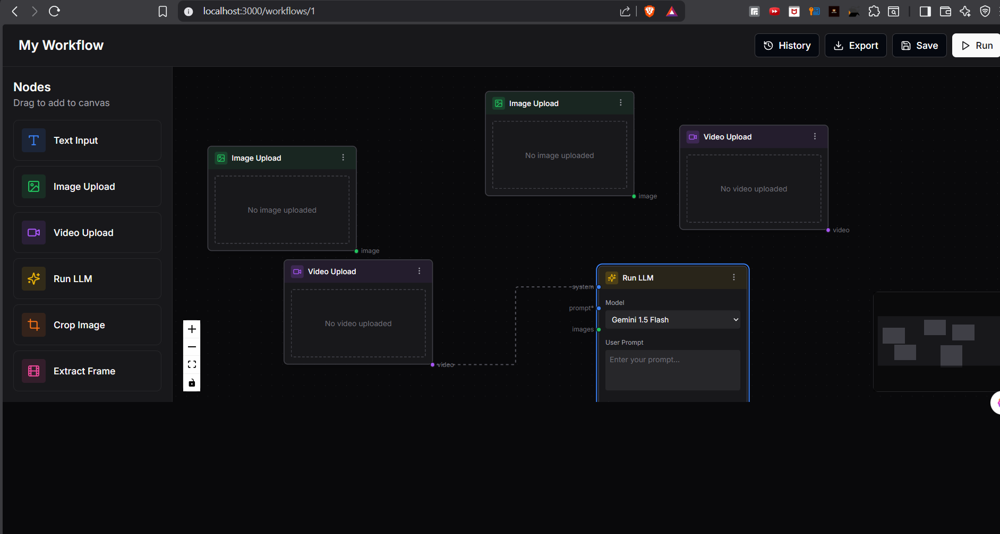
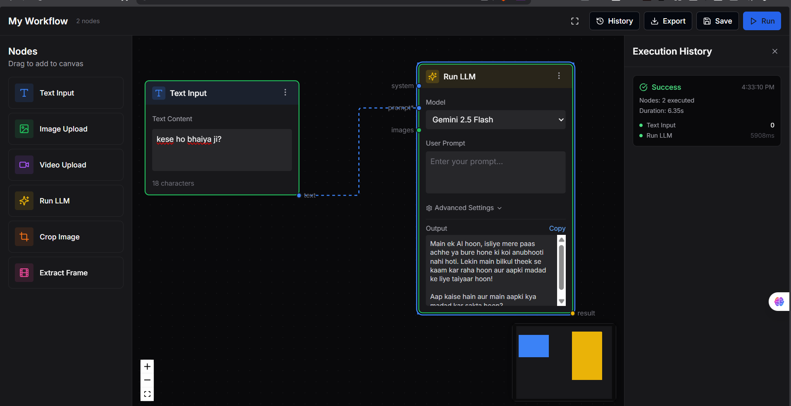
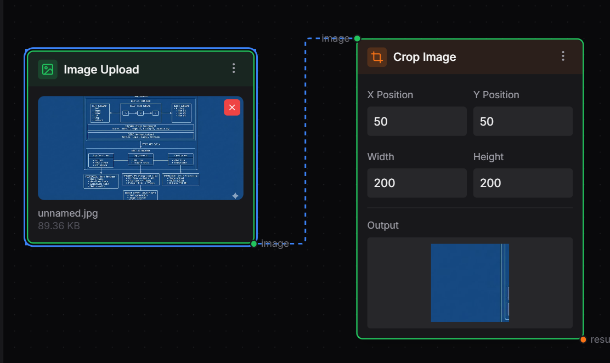
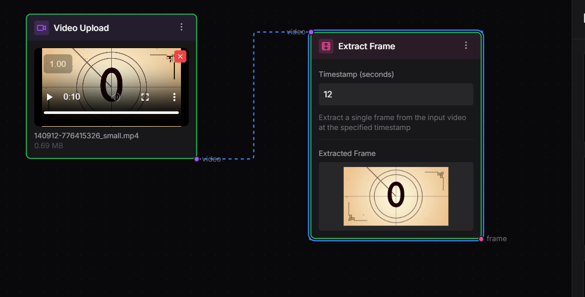

# Workflow Builder

A visual workflow builder for automating tasks with AI. Connect nodes, upload media, run LLM prompts, and process images and videos.

Built with Next.js, React Flow, and PostgreSQL.

## What It Does

This app lets you build workflows visually by connecting different nodes together. Each node does something specific:

- Text Input: Add text that flows to other nodes
- Image Upload: Upload images for processing
- Video Upload: Upload videos for frame extraction
- Run LLM: Send prompts to Google Gemini AI
- Crop Image: Crop uploaded images
- Extract Frame: Pull a frame from a video at a specific timestamp

You connect these nodes together, click Run All, and the workflow executes in order.

## Screenshots

### Sign In


### Dashboard


Shows all your saved workflows. Click one to edit it or create a new one.

### Workflow Editor


The main canvas where you drag nodes, connect them, and build your workflow.

### Building a Workflow


Drag nodes from the sidebar and connect them together.





### Execution


Click Run All and the workflow executes. Results show in the History sidebar.

## How to Run Locally

1. Clone the repo

```bash
git clone https://github.com/ashutosh-012/weavy-clone-workflow-builder.git
cd weavy-clone-workflow-builder
```

2. Install dependencies

```bash
npm install
```

3. Set up environment variables

Create a `.env` file in the root:

```
DATABASE_URL=your_neon_postgres_url
NEXT_PUBLIC_CLERK_PUBLISHABLE_KEY=your_clerk_key
CLERK_SECRET_KEY=your_clerk_secret
GOOGLE_AI_API_KEY=your_gemini_api_key
NEXT_PUBLIC_APP_URL=http://localhost:3000
```

4. Push database schema

```bash
npx drizzle-kit push
```

5. Run the dev server

```bash
npm run dev
```

Open http://localhost:3000

## Tech Stack

- Next.js 14 with App Router
- React Flow for the node canvas
- Drizzle ORM with PostgreSQL on Neon
- Clerk for authentication
- Google Gemini API for LLM
- Tailwind CSS
- Zustand for state management

## Project Structure

```
app/
  dashboard/       - workflow list page
  workflows/[id]/  - workflow editor page
  api/
    workflows/     - CRUD for workflows
    execute/       - run workflow endpoint
    process/       - image and video processing
components/
  nodes/           - all node types
  workflow/        - canvas, toolbar, sidebars
lib/
  db/              - database connection and schema
  store.ts         - zustand store
  execution-engine.ts - runs the workflow
```

## How Workflows Work

1. Drag nodes from the left sidebar onto the canvas
2. Connect them by dragging from output handles to input handles
3. Click Run All
4. The app figures out execution order based on connections
5. Each node runs in sequence, passing its output to connected nodes
6. Results are saved to the database and shown in History

## Current Limitations

- Video frame extraction is simulated
- Image cropping is simulated
- No undo/redo yet
- No real-time collaboration

## Author

Built by Ashutosh

## License

MIT